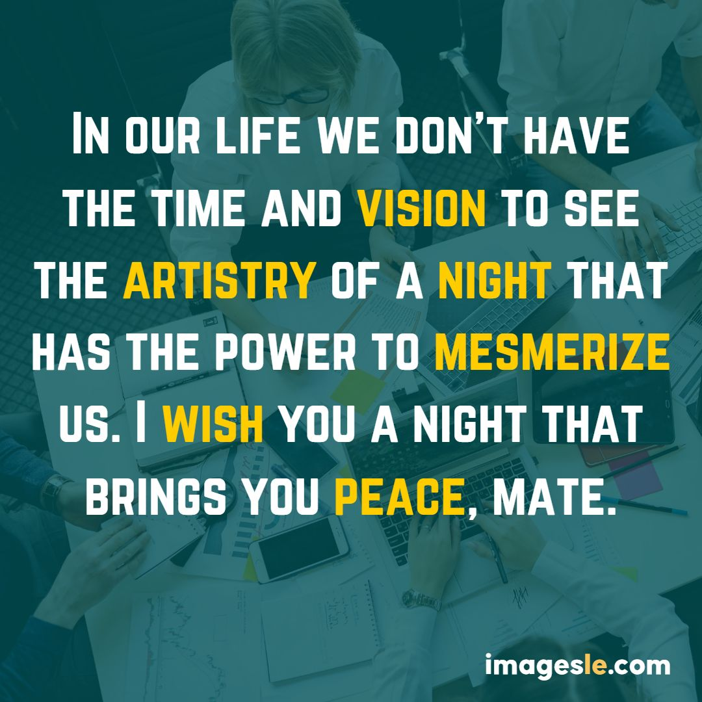
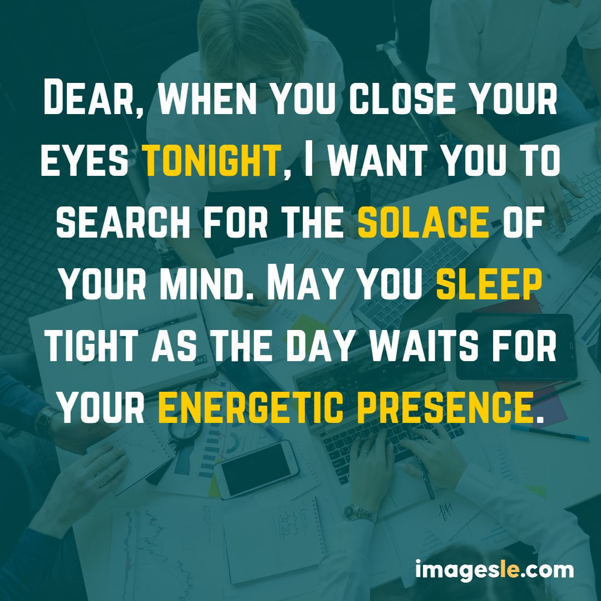
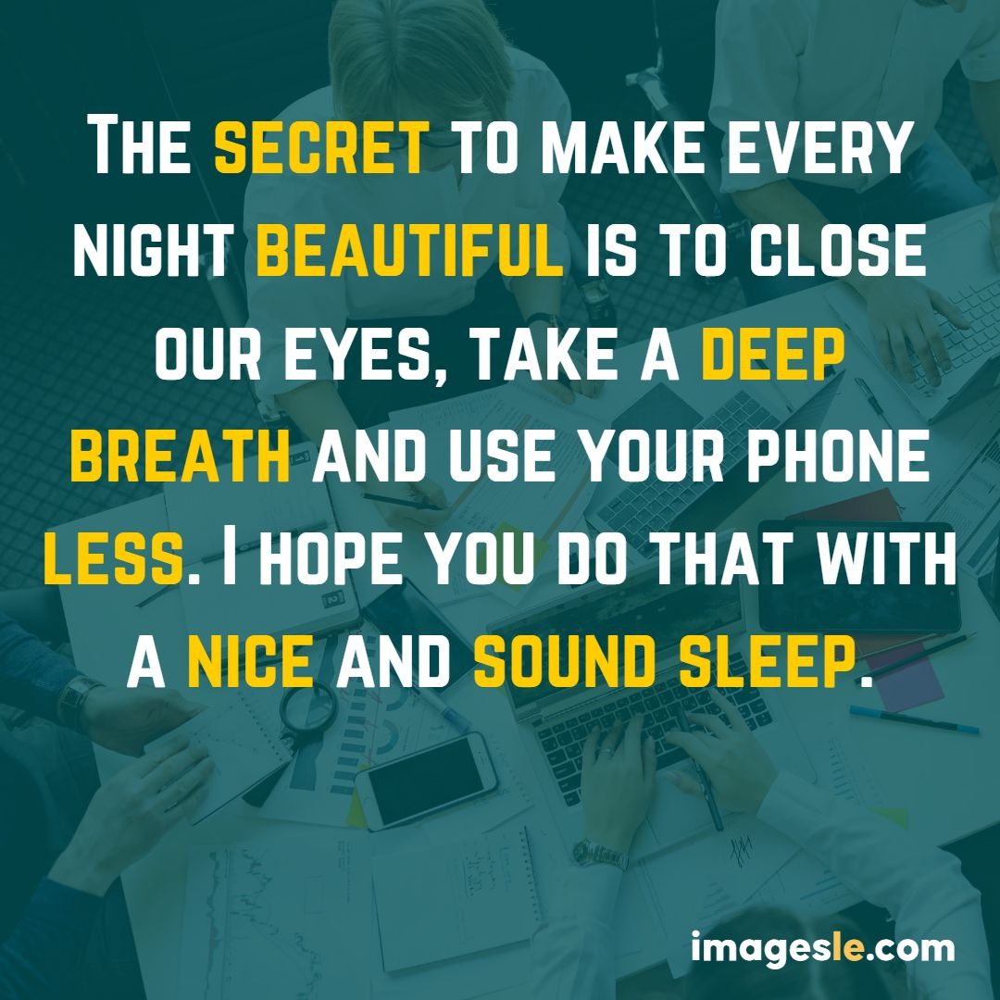

## 15 Best Good Night Images to wish Team and Colleagues

**Team and colleagues,**

We hope you have a **good night**. Here are some **good night images** to wish your team and colleagues.
There's something special about saying goodnight to those you care about, and no one knows that better than a team of friends and colleagues. Whether it's a group hug before bed or just a friendly smile, these 15 best **good night images** will make everyone feel loved and wished well.

#### There are few problems while wishing:

1. Wishing everyone a good night is always a hassle-free task with these 15 best **good night images**! Whether you’re sending a team-wide picture, or just to one person, these will do the trick.
2. Not sure what to say when your colleague says goodnight? These phrases will help you out!
3. Sometimes all we need is a little love and support, which is why these 15 best **good night images** are perfect for anyone on your list.
4. No matter how much work you have ahead of you, know that someone in your life loves and supports you – thank them with one of these special good night messages!
5. Whether it’s family members, friends or significant others, we all need someone to lean on from time to time – let them know with one of these heartfelt **good night quotes**!

In order to wish all of your loved ones good night, here are 15 best **good night images** to send them.

## The Best Good Night Images Sites on the Web (good night images)

In this article, we will be looking at some of the best **good night images** sites on the web. The idea is to get a general idea about these sites and see how they are different from each other.

A **good night image** is a perfect way to make your clients feel relaxed and comfortable. It can also be used as an effective tool for generating content ideas for your clients, especially if you want to show off your creativity in writing content, or just want to add some variety in your work.

Wishing all of your team and colleagues a good night! These 15 images will help you achieve sweet dreams.
You don't have to be a rocket scientist to know that one of the best things about goodnight pictures is that they always make people feel sentimental. Whether it's your friends and family, or your work colleagues, everyone loves getting a goodnight picture to remember their time together. So if you're looking for an easy way to say goodbye and wish everyone well on their journey towards sleep, scroll down for our top 15 best **good night images**!

In conclusion, here are some **good night images** to send your loved ones and colleagues. If you're feeling sentimental, why not add a photo of you and your loved ones at a favorite memory spot? Sending these messages will help ensure that they have a good night as well!