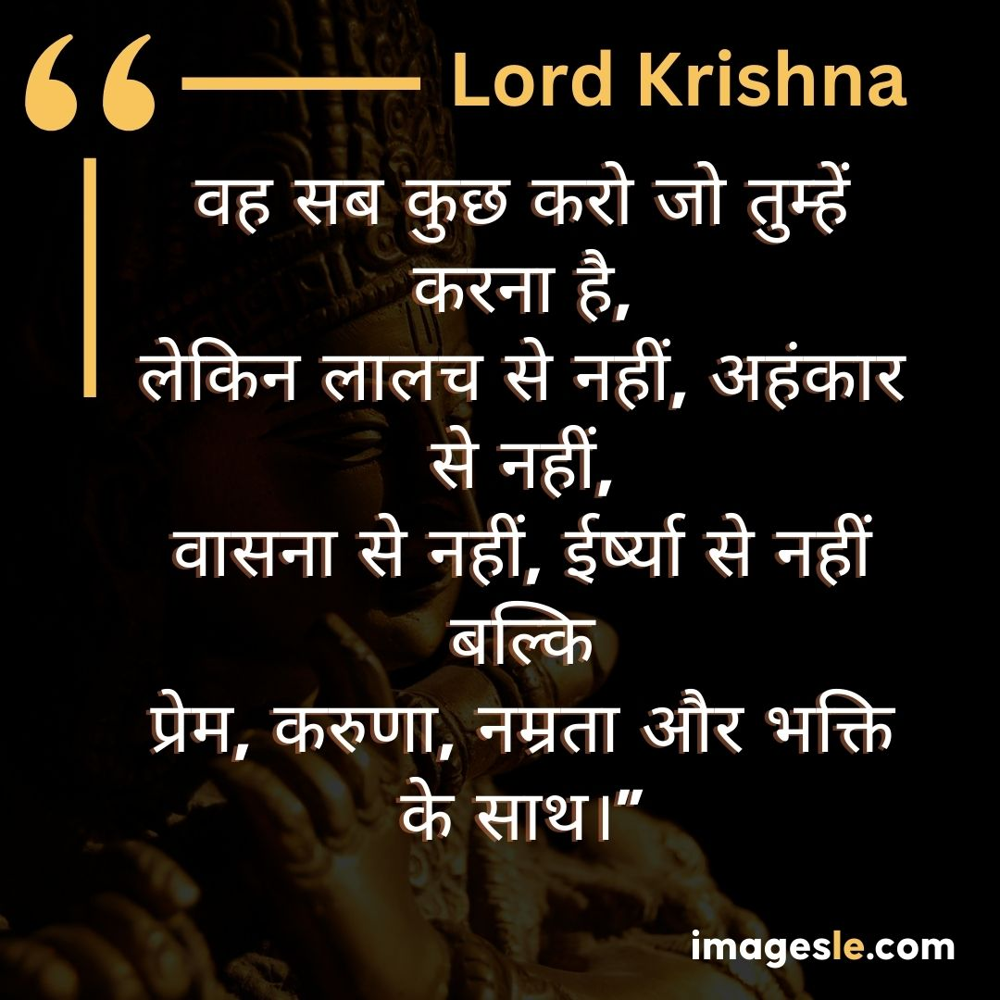
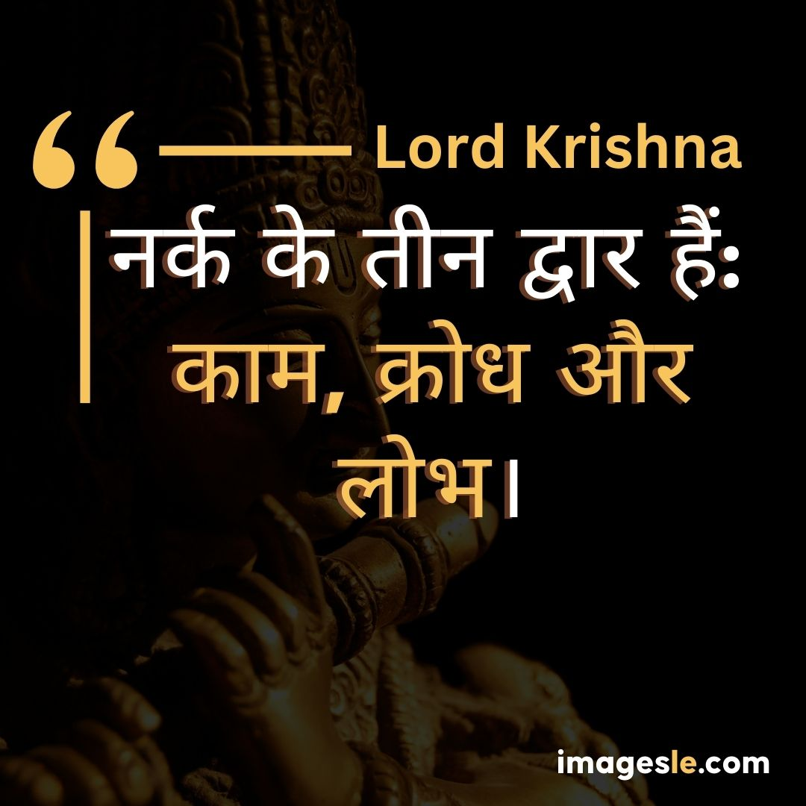
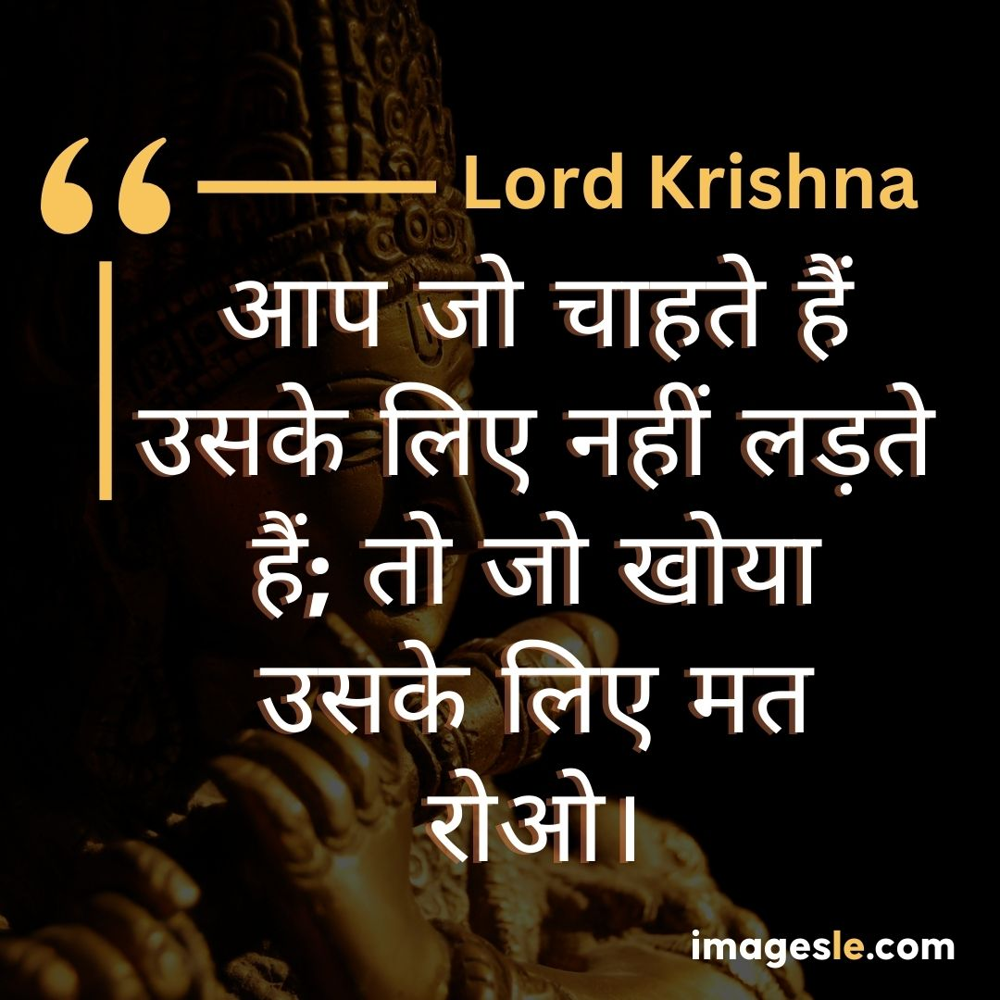
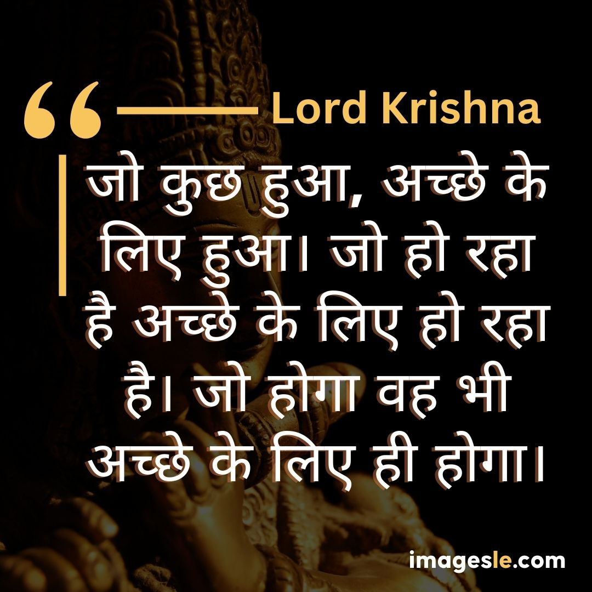
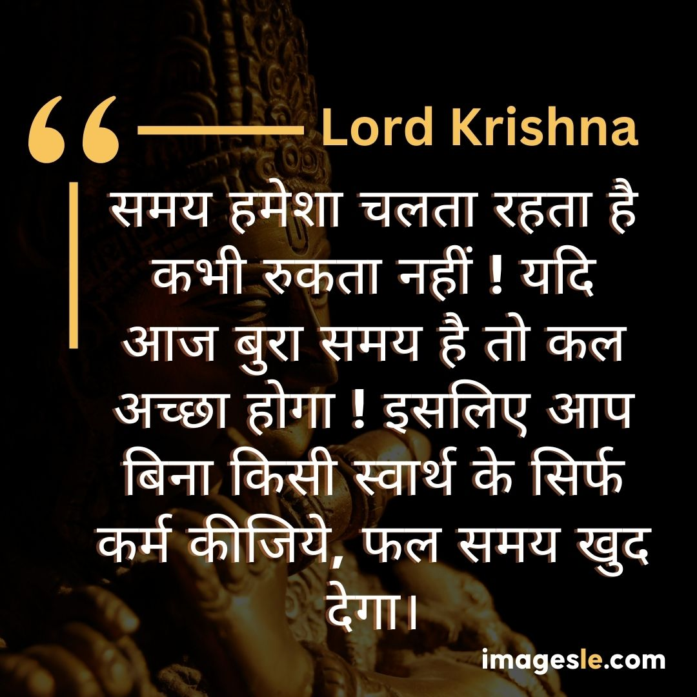
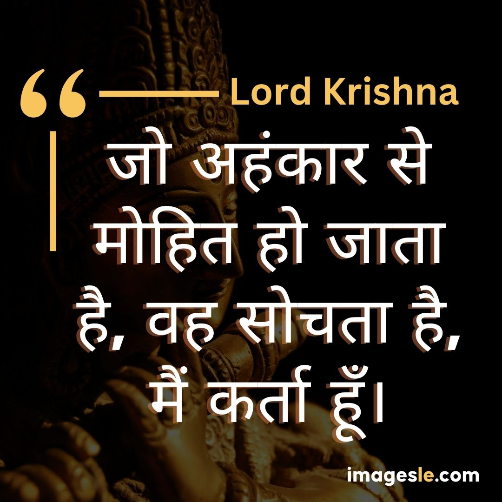
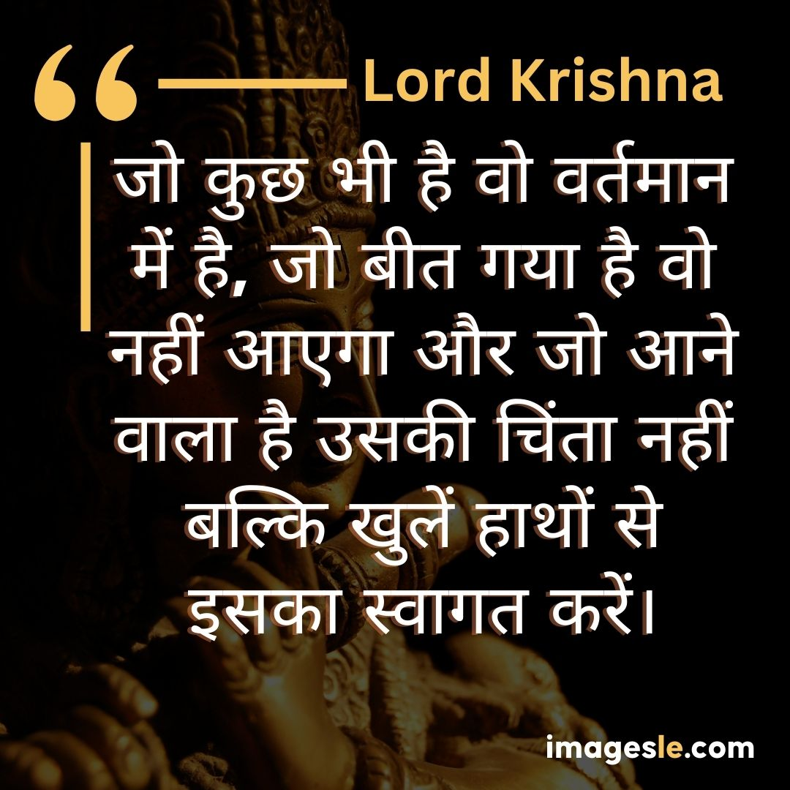
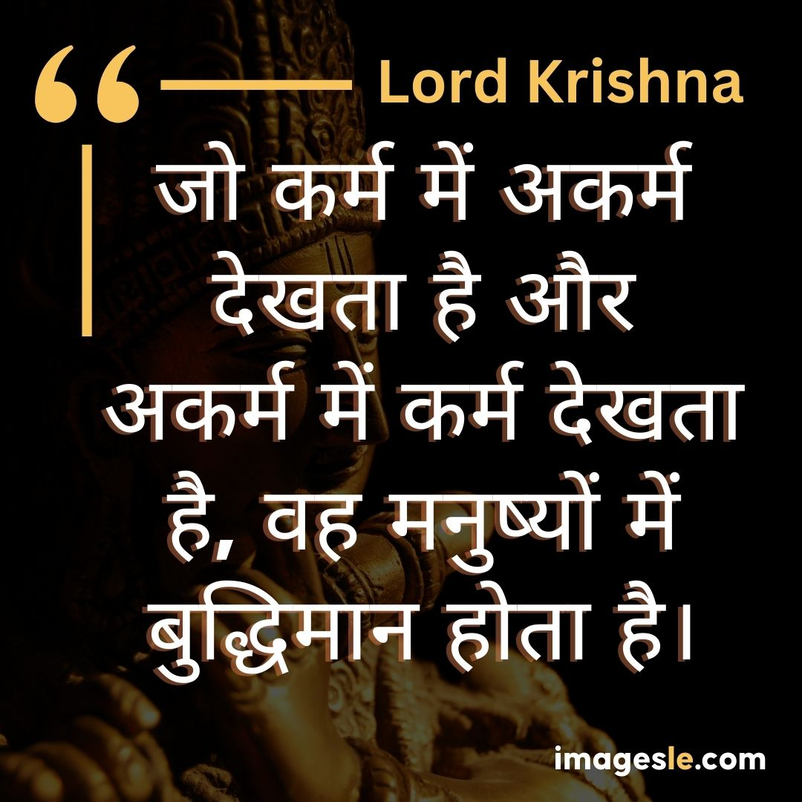
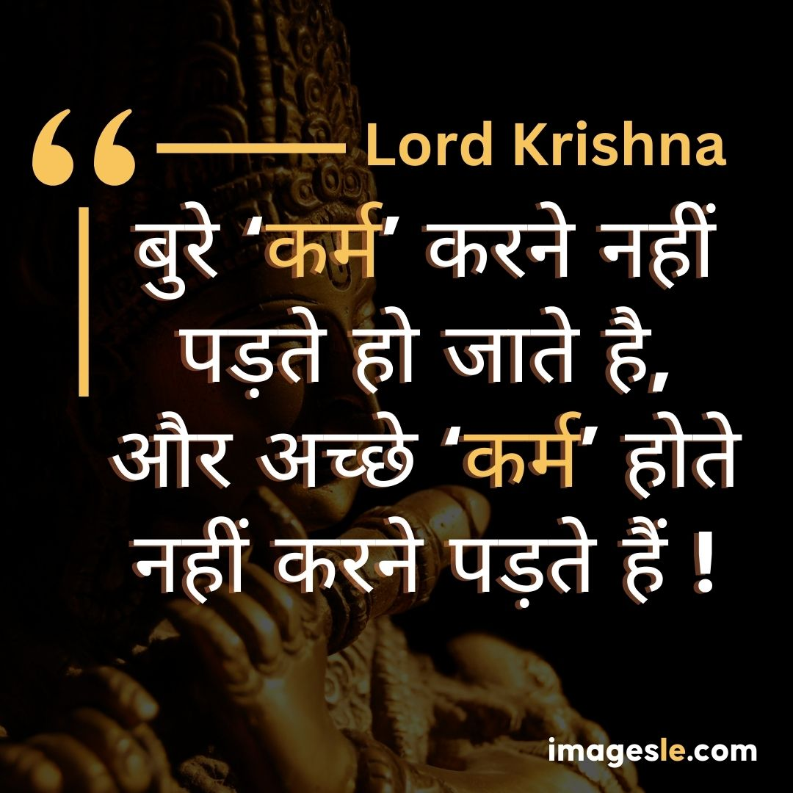

## 20 Lord Krishna Images Quotes in Hindi

This article will discuss the 20 Lord Krishna Images Quotes in Hindi. It will provide you with a list of 20 quotes that can be used to motivate your audience toward their goals and dreams.

1\. Lord Krishna is one of the most loved and revered deities in Hinduism. His love stories, miracles, and teachings have touched the hearts of people across the world. In this article, we provide 20 quotes about Lord Krishna in Hindi.

2\. "If you want to go to heaven, sell your possessions and give the money to the poor. If you want to go to heaven, chant Hare Kṛṣṇa." -Lord Krishna

3\. "People come into this world thinking they are going to leave it with some great accomplishment or memory or something that will be remembered for a long time... But what happens? They all die! And what's left behind is just dust.

If you are looking for a quote on Lord Krishna, look no further. This is a collection of 20 facts and figures about the divine manifestation of God in Hinduism.

This article will help you to know more about the history and significance of Lord Krishna in Hinduism. You will also get to know some of the important facts and figures about this divine manifestation.

Lord Krishna is one of the most popular Hindu deities. He is regarded as the supreme god, who is worshipped in the form of a human being. Lord Krishna was born to parents Devaki and Janaka in Vrindavan, India, and was believed to be an incarnation of Vishnu.

These 20 Lord Krishna Images Quotes in Hindi are all about the glory of Lord Krishna. He is supreme among all Gods and humans. He is also known as Krishna.

### वह सब कुछ करो जो तुम्हें करना है,लेकिन लालच से नहीं, अहंकार से नहीं,वासना से नहीं, ईर्ष्या से नहीं बल्कि प्रेम, करुणा, नम्रता और भक्ति के साथ। – krishna images

***

### नर्क के तीन द्वार हैं: काम, क्रोध और लोभ। – krishna images

***

### आप जो चाहते हैं उसके लिए नहीं लड़ते हैं; तो जो खोया उसके लिए मत रोओ। – krishna images

### ठंड या गर्मी, सुख या दर्द का अनुभव करें। ये अनुभव क्षणभंगुर हैं; वे आते हैं और जाते हैं। उन्हें धैर्यपूर्वक सहन करें। – krishna images

***

### सत्य कभी नष्ट नहीं हो सकता। अच्छा करने से नहीं डरना चाहिए। – krishna images

***

Lord Krishna is one of the most popular Hindu deities. He is the central figure in many Indian religious traditions and legends. He is also known as Adi Shankaracharya, a great saint, philosopher and poet from India.

In the Indian religion, he is considered as a supreme deity who has been worshipped since ancient times by Hindus.

The word "krishna" means "lord" or "master". It was used to refer to the Hindu god Krishna in ancient India. One of his names was Krishna Dvaipayana Vyasa (Krishna Swayamvara), who wrote about him in Sanskrit literature. In addition to this, there are many other names for him such as Bhagavan, Bhakti-devotee (devotee of Lord God), etc.. The word krishna has been used by different religious sects in different parts of India like Vaishnavism, Shaivism and Shaktism while they were

### इस शरीर का मोह मत करो, यह तो माटी है माटी में मिल जायेगा, अमर तो आत्मा है जो परमात्मा में मिल जाएगी। – krishna images

***

### मन चंचल है इसे और संयमित करना कठिन है, लेकिन यह अभ्यास से वश में हो जाता है। – krishna images

***

### जो कुछ हुआ, अच्छे के लिए हुआ। जो हो रहा है अच्छे के लिए हो रहा है। जो होगा वह भी अच्छे के लिए ही होगा। – krishna images

***

### आप वही हैं जिसमें आप विश्वास करते हैं, आप वह बन जाते हैं जो आप मानते हैं कि आप बन सकते हैं। – krishna images

***

### जिस इंसान के चारों तरफ नकारात्मक लोग रहते हैं, उस इंसान का मंजिल से भटक जाना तय है। – krishna images

***

The 20 Lord Krishna Images Quotes in Hindi are a collection of 20 Lord Krishna images quotes in Hindi. This is a collection of 20 Lord Krishna images quotes that have been translated into Hindi by the famous Indian poet, author and scholar, K Satchidanandan.

The words of wisdom and inspiration that have been attributed to the Lord are taken from his own words, as well as his holy writings, such as the Bhagavad Gita. These quotes are meant to be inspirational and motivational for all people. They help us to live our lives in a better way.

### समय हमेशा चलता रहता है कभी रुकता नहीं ! यदि आज बुरा समय है तो कल अच्छा होगा ! इसलिए आप बिना किसी स्वार्थ के सिर्फ कर्म कीजिये, फल समय खुद देगा। – krishna images

***

### जो अहंकार से मोहित हो जाता है, वह सोचता है, मैं कर्ता हूँ। – krishna images

***

### मैं किसी का भाग्य निर्माण नहीं करता, हर व्यक्ति अपना भाग्य स्वयं बनता है। – krishna images

***

### जो कुछ भी है वो वर्तमान में है, जो बीत गया है वो नहीं आएगा और जो आने वाला है उसकी चिंता नहीं बल्कि खुलें हाथों से इसका स्वागत करें। – krishna images

***

### जो कर्म में अकर्म देखता है और अकर्म में कर्म देखता है, वह मनुष्यों में बुद्धिमान होता है। – krishna images

***

Lord Krishna is the name of a Hindu deity. He is one of the most popular and well-known deities in India. He has been worshipped since ancient times and his image has been found in all major religions, including Buddhism, Jainism and Christianity.

There are many famous images of Lord Krishna in different forms. Some are from South India while others come from North India and other parts of the world. The following images are taken from various sources:

### आत्मा विनाश से परे है। कोई भी उस आत्मा का अंत नहीं कर सकता जो अनन्त है। – krishna images

***

### खुशी मन की एक ही अवस्था है, जिसका बाहरी दुनिया से कोई लेना-देना नहीं है। - krishna images

***

### कोई भी व्यक्ति जो अच्छा काम करता है, उसका कभी भी बुरा अंत नहीं होगा, चाहे यहाँ या आने वाले संसार में।  – krishna images

***

### जिनके मन और आत्मा में सामंजस्य है, जो इच्छा और क्रोध से मुक्त हैं, जो अपनी आत्मा को जानते हैं, उनके साथ ईश्वर की शांति है। – krishna images

***

### बुरे ‘कर्म’ करने नहीं पड़ते हो जाते है, और अच्‍छे ‘कर्म’ होते नहीं करने पड़ते हैं ! – krishna images

***

In conclusion,these 20 Lord Krishna images quotes in Hindi provide a beautiful reminder of the infinite love and compassion of this divine being. Now is the time to return to Krishna's gentle guidance and embrace His infinite love and light in your life.