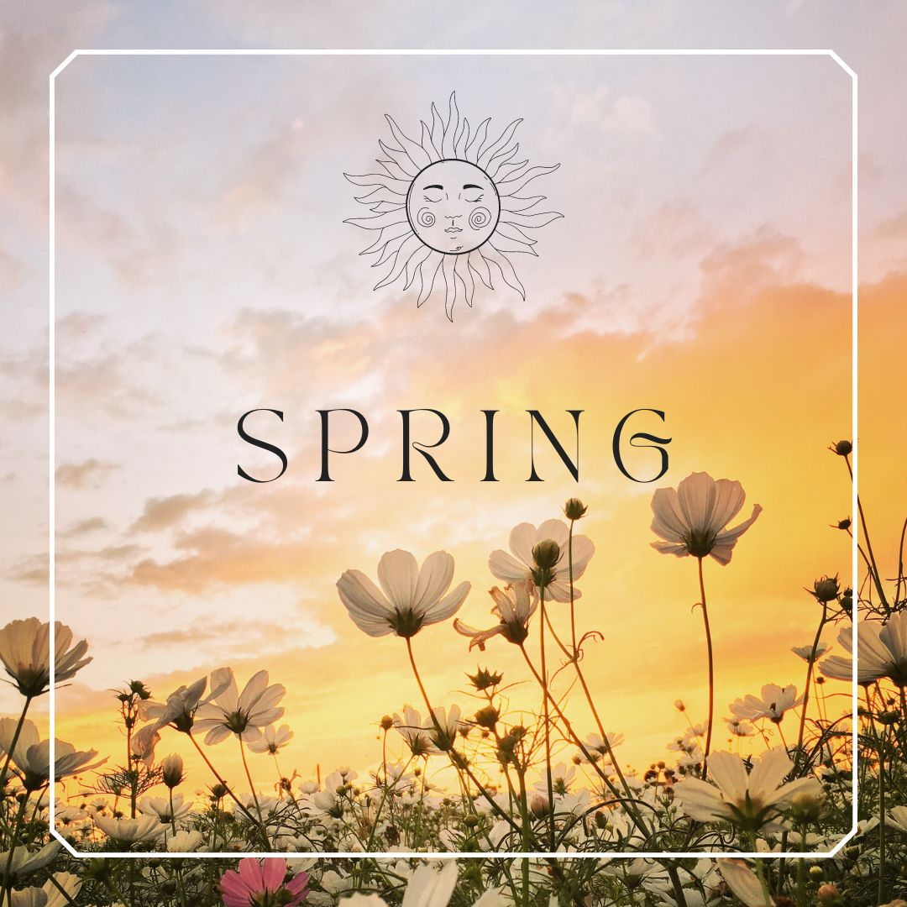

## 25 Flower Images with Greetings Best for sharing with Relatives and Loved once

Flower images are the perfect way to show affection to relatives and loved ones. Whether you're sending a picture of a bouquet or just posing with a few blooms in your hand, these unique pictures will leave them speechless. Here are 25 flower images that will make your loved ones happy!

Flowers represent beauty, love, and joy. They are the perfect way to show someone you care. Whether you're sending flowers as a gesture of goodwill or because you miss them, these 25 flower images will make your loved ones feel loved and special.

Flowers are one of the most popular ways to show someone you care. Whether it's a bouquet for a loved one or just a bunch of daisies to brighten someone's day, there is no better way to say "I love you" than with a beautiful flower arrangement. Here are 25 flower images that will make your relatives and loved ones happy, regardless of where they are in the world:

1. A mix of fresh flowers and foliage in a vase is the perfect way to show appreciation for any occasion.
2. Bouquets can be customized to every preference, so you're sure to find the right flower arrangement for everyone in your family.
3. Make sure to buy enough flowers so that you have enough left over to give away as gifts!

Are you looking for beautiful flower images to share with relatives and loved ones? Here are 25 of the best! These blooms can express love, congratulations, or just happiness. Whether you're sending a happy birthday message or trying to brighten someone's day, these flowers will do the trick!

A rose is a beautiful flower. The petals' color and the leaves shape are all beautiful and unique. A rose has a long history in many cultures. It has been used as an emblem of love, beauty, and passion. People have used it to symbolize hope, romance, and happiness.
In modern times, roses have become popular as they can express love and affection or even condolences over death or sadness. They are also used to celebrate special occasions such as weddings, anniversaries, birthdays, or other events that bring joy to people's lives.
In this article, we will show you some fantastic images of flowers with greetings that you can use for personal or professional use!

We all have a lot of pictures we like to show our loved ones, family members and friends. But there are not enough flower images to choose from. So here is a collection of 25 beautiful flower images with greetings that you can use as a greeting card or send to your loved ones.

Great images of flowers can be a great way to make your life more beautiful. Here are 25 flower images with greetings that will help you to share them with your loved ones and loved ones once again.

This is a beautiful and inspiring collection of 25 flower images with greetings. It is perfect for sharing with relatives and loved ones.
Some people are not fond of using flower images in their emails. This article will help you create beautiful, yet meaningful, flower images for your content.

In conclusion,these 25 flower images with greetings are perfect for sharing with relatives and loved ones. They are simple, yet powerful messages that will warm their hearts. So go ahead and send them a quick email or text message! Let them know you care about them and want to say hello.