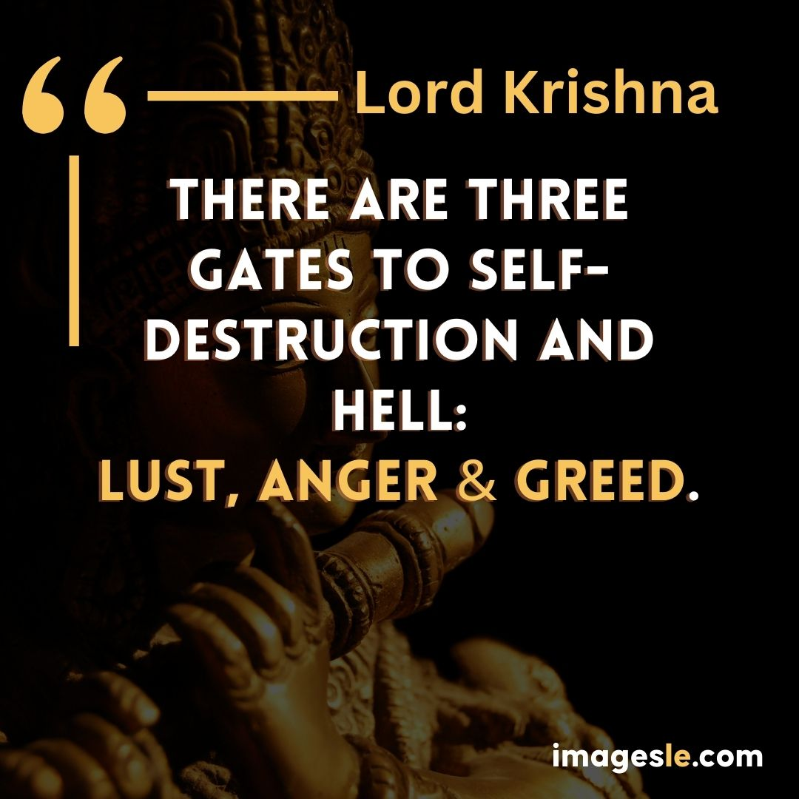
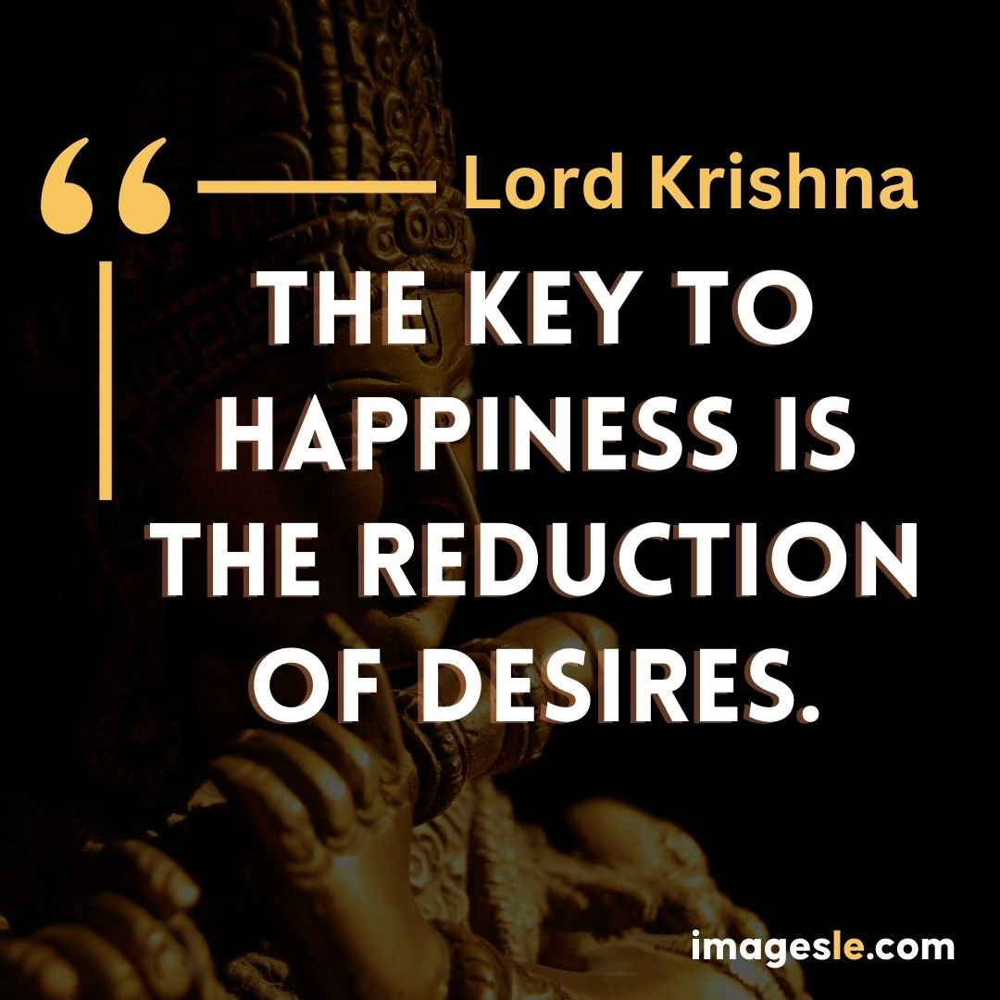
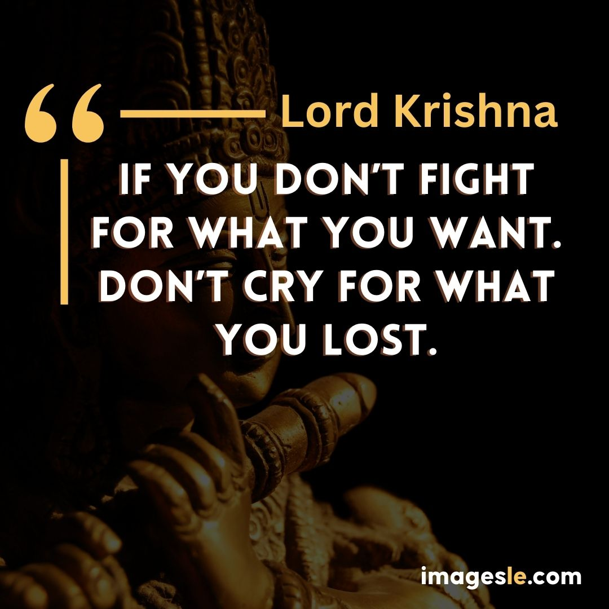
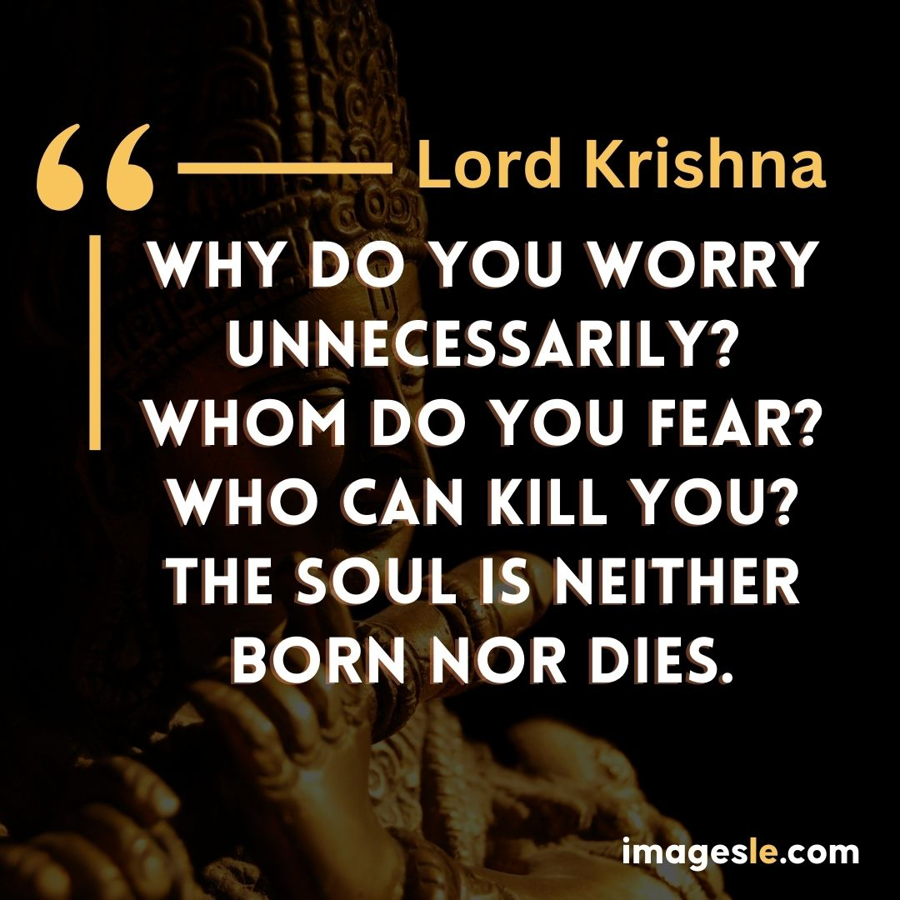
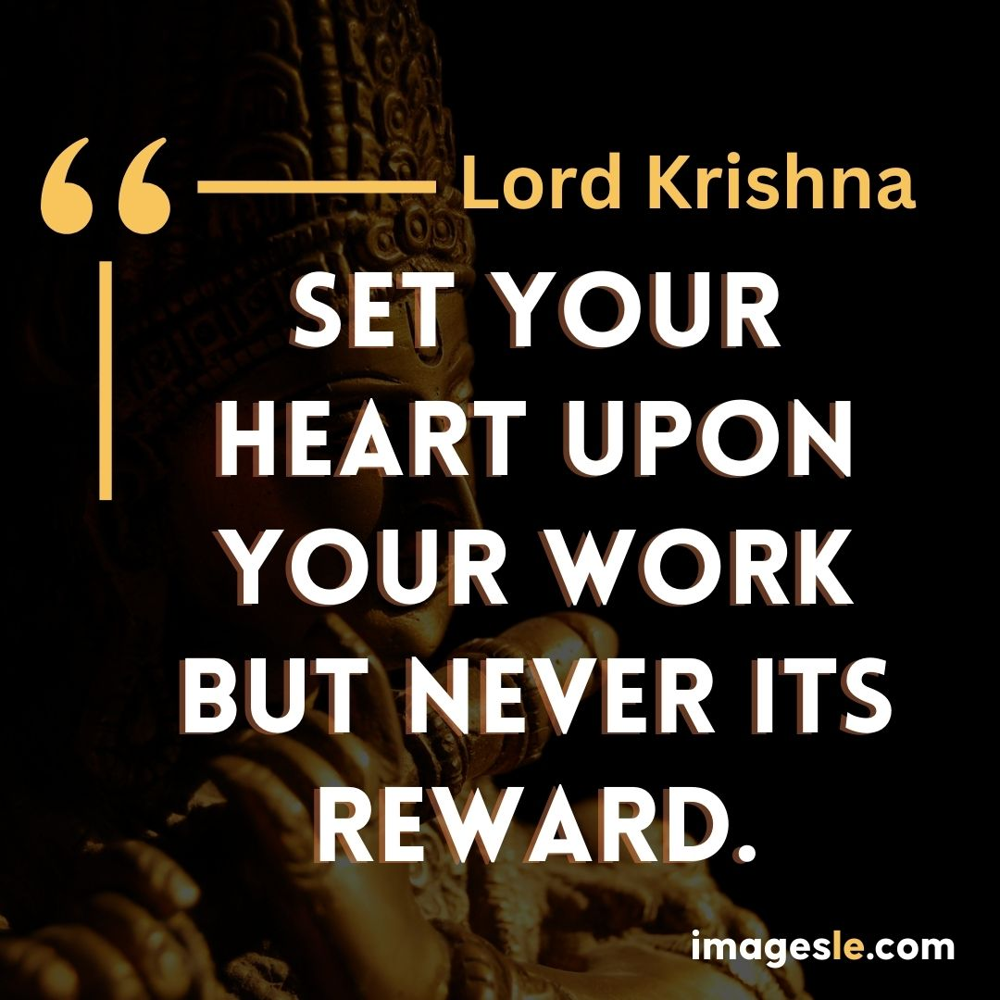
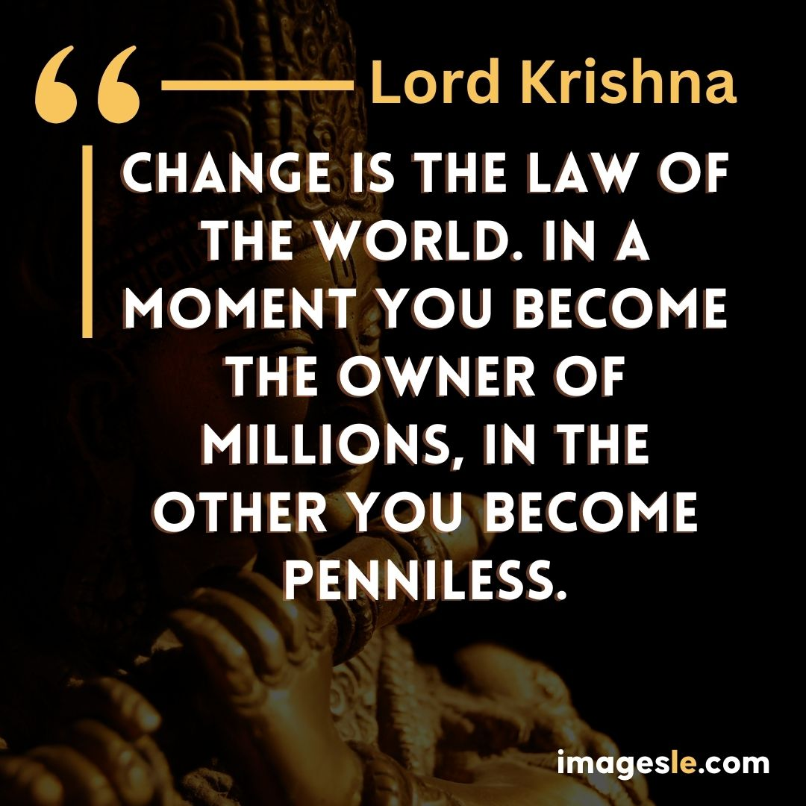
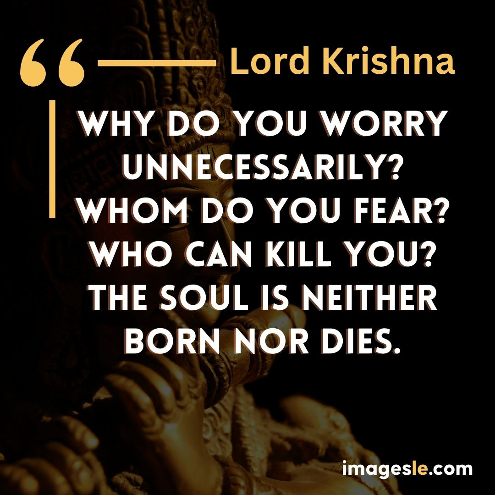

## 20 Lord Krishna Images Quotes in English

This article will discuss the 20 Lord Krishna Images Quotes in English. It will provide you with a list of 20 quotes that can be used to motivate your audience toward their goals and dreams.

1\. Lord Krishna is one of the most loved and revered deities in Hinduism. His love stories, miracles, and teachings have touched the hearts of people across the world. In this article, we provide 20 quotes about Lord Krishna in English.

2\. "If you want to go to heaven, sell your possessions and give the money to the poor. If you want to go to heaven, chant Hare Kṛṣṇa." -Lord Krishna

3\. "People come into this world thinking they are going to leave it with some great accomplishment or memory or something that will be remembered for a long time... But what happens? They all die! And what's left behind is just dust.

If you are looking for a quote on Lord Krishna, look no further. This is a collection of 20 facts and figures about the divine manifestation of God in Hinduism.

This article will help you to know more about the history and significance of Lord Krishna in Hinduism. You will also get to know some of the important facts and figures about this divine manifestation.

Lord Krishna is one of the most popular Hindu deities. He is regarded as the supreme god, who is worshipped in the form of a human being. Lord Krishna was born to parents Devaki and Janaka in Vrindavan, India, and was believed to be an incarnation of Vishnu.

These 20 Lord Krishna Images Quotes in English are all about the glory of Lord Krishna. He is supreme among all Gods and humans. He is also known as Krishna.

### There are three gates to self-destruction and hell: Lust, Anger & Greed. – krishna images

---

### A man is made by his beliefs. As he believes. So he becomes – krishna images

---

### The Key to happiness is the reduction of desires – krishna images

### Perform your obligatory duty, because action is indeed better than inaction – krishna images

---

### If you don't fight for what you want. Don't cry for what you lost – krishna images

---

Lord Krishna is one of the most popular Hindu deities. He is the central figure in many Indian religious traditions and legends. He is also known as Adi Shankaracharya, a great saint, philosopher and poet from India.

In the Indian religion, he is considered as a supreme deity who has been worshipped since ancient times by Hindus.

The word "krishna" means "lord" or "master". It was used to refer to the Hindu god Krishna in ancient India. One of his names was Krishna Dvaipayana Vyasa (Krishna Swayamvara), who wrote about him in Sanskrit literature. In addition to this, there are many other names for him such as Bhagavan, Bhakti-devotee (devotee of Lord God), etc.. The word krishna has been used by different religious sects in different parts of India like Vaishnavism, Shaivism and Shaktism while they were

### The self controlled soul, who moves amongst sense objects, free from either attachment or repulsion, he wins eternal peace. – krishna images

---

### For one who has conquered his mind, a mind is best of friends, but for one who has failed to do so, a mind is the greatest enemy – krishna images

---

### Happiness is a state of mind, that has nothing to do with the external world – krishna images

---

### Why do you worry unnecessarily? Whom do you fear? Who can kill you? The soul is neither born nor dies. – krishna images

---

### Set your heart upon your work but never its reward – krishna images

---

The 20 Lord Krishna Images Quotes in English are a collection of 20 Lord Krishna images quotes in English. This is a collection of 20 Lord Krishna images quotes that have been translated into English by the famous Indian poet, author and scholar, K Satchidanandan.

The words of wisdom and inspiration that have been attributed to the Lord are taken from his own words, as well as his holy writings, such as the Bhagavad Gita. These quotes are meant to be inspirational and motivational for all people. They help us to live our lives in a better way.

### The only way you can conquer me is through love, and there I am gladly conquered – krishna images

---

### Among all kind of killers, time is the ultimate because time kills everything – krishna images

---

### Calmness, gentleness, silence, self-restraint and purity: these are the disciplines of the mind. – krishna images

---

### The mind is fickle. It won’t obey you every time the mind misbehaves, use your discretionary intellect to bring it back to the equanimous position. – krishna images

---

### When a person responds to the joys and sorrows of others as though they were his own, he or she has attained the highest spiritual union – krishna images

---

Lord Krishna is the name of a Hindu deity. He is one of the most popular and well-known deities in India. He has been worshipped since ancient times and his image has been found in all major religions, including Buddhism, Jainism and Christianity.

There are many famous images of Lord Krishna in different forms. Some are from South India while others come from North India and other parts of the world. The following images are taken from various sources:

### Change is the law of the world. In a moment you become the owner of millions, In the other you become penniless. – krishna images

---

### Fear not, what is not real, never was and never will be. what is real, always was can and cannot be destroyed - krishna images

---

### Whatever happened was good. What’s happening is going well. Whatever will happen will also be good. Do not worry about the future. Live in the present. – krishna images

---

### Why do you worry unnecessarily? whom do you fear? who can kill you? the soul is neither born nor dies. – krishna images

---

### Do everything you have to do, but not with ego, not with lust, not with envy but with love, compassion, humility, and devotion. – krishna images

---

In conclusion,these 20 Lord Krishna images quotes in English provide a beautiful reminder of the infinite love and compassion of this divine being. Now is the time to return to Krishna's gentle guidance and embrace His infinite love and light in your life.