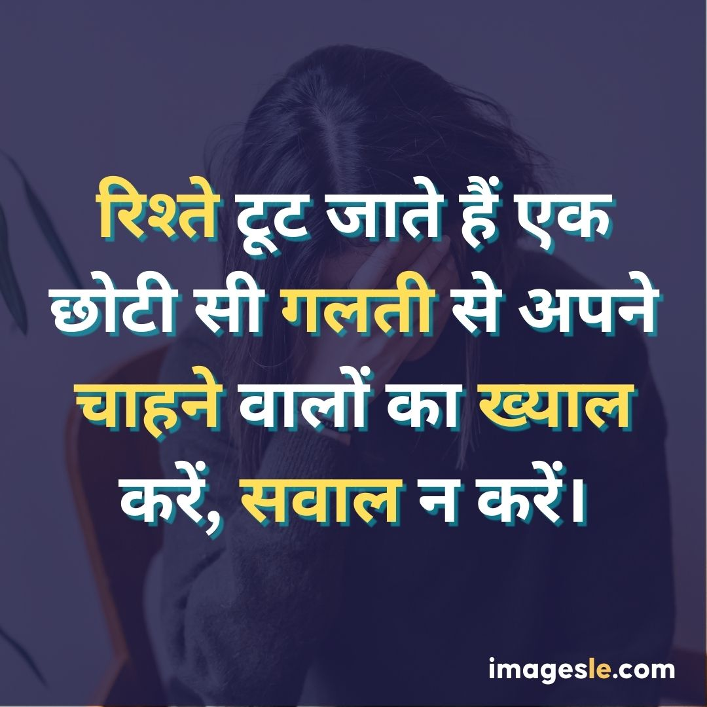
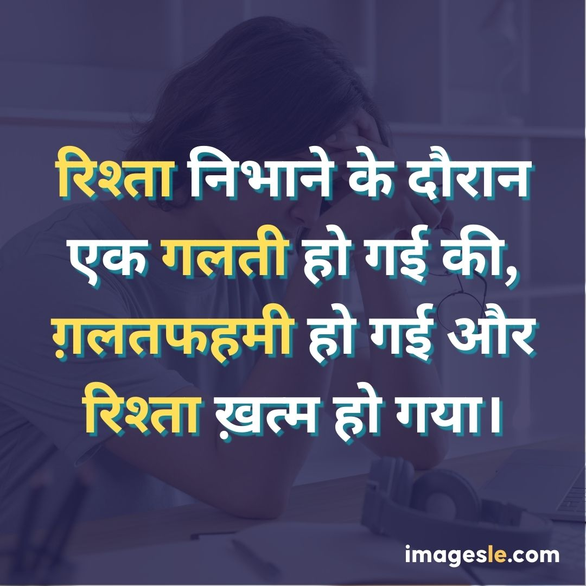
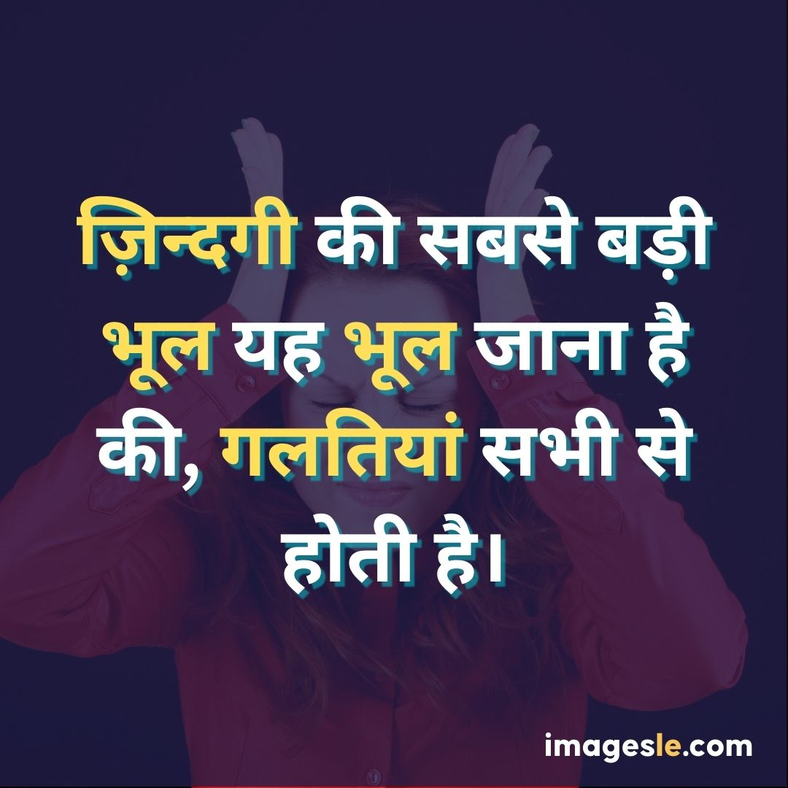
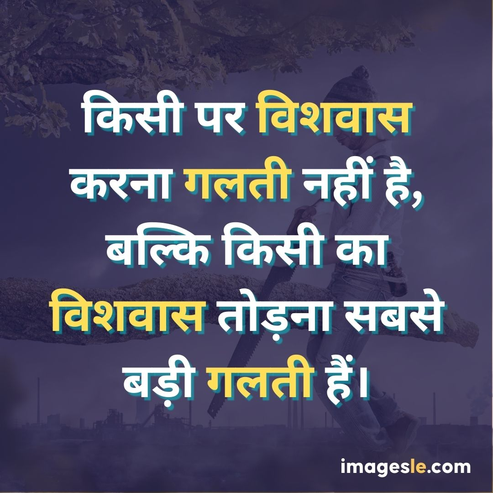
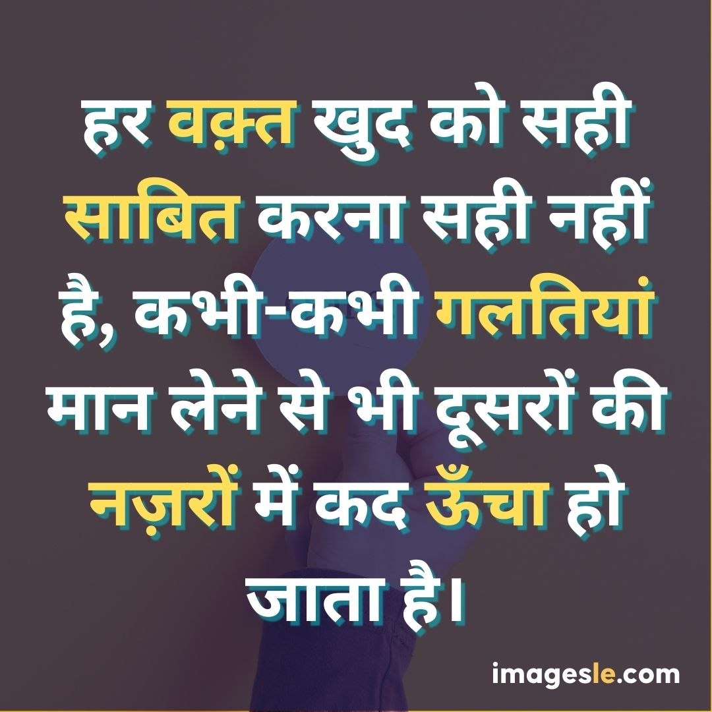

**Galti ka ehsaas shayari images** strike the right tone to get ahead. These inspiring poems can set the right style and help you achieve your goals. The proper technique can make all the difference in getting what you want, and these poems will help you find it.

1. **Galti ka ehsaas shayari images** can help you set the right tone and achieve your goals.
2. These poems can inspire you to take action and reach your goals.
3. They can help you focus on what's important and stay motivated.
4. Keep these poems close by and use them to get ahead!
5. Thank you for reading.

**Galti ka ehsaas shayari images** strike the right tone to get ahead. With these inspiring poems, you can set the right style and achieve your goals. Poems about success can be powerful motivators, and using them in your work or personal life can help you reach your goals.

The poets use light-hearted rhymes and memorable phrases to convey their messages in these examples. Some of the most potent **galti ka ehsaas shayari images** inspire hope and perseverance. They remind us that anything is possible if we put our minds to it—and that we can always find a way to succeed.

The right tone is critical to any successful endeavor. Whether in the boardroom or the bedroom, a particular atmosphere can set expectations and help achieve goals. And when it comes to getting ahead, nothing beats striking the right tone. That’s why we’ve gathered some of the most inspiring poems about **galti ka ehsaas shayari images**. They’ll help you set the right mood, put your mind at ease, and get on track for success. So grab a cup of coffee (or tea if you prefer), and let these poems take your mind off work.

There's a specific power that comes with being in control. It can give you confidence and allow you to achieve your goals. And that's why **galti ka ehsaas shayari images** are so inspiring. They tap into that feeling of empowerment and help you take charge of your life.

These poems show us that no matter who we are or what we've been through, there's always the potential for growth and progress. They tell us that anything is possible if we set our minds to it and work hard enough. And that's the message these poems deliver – no matter your situation, there's always hope for a brighter future.

**Galti ka ehsaas shayari images** strike the right tone to get ahead. They inspire and convey that you can achieve anything if you set your mind to it. This is especially true if you use these poems to motivate yourself during tough times. When you see these poems, you'll be inspired to push yourself harder and work harder towards your goals.
When you're feeling down, and all of your efforts seem to be in vain, look at these inspiring poems about success. They'll give you the right attitude and help you reach your goals. In these short but powerful verses, you'll find advice on how to succeed and build a successful career. So read on and don't let yourself get discouraged – with a bit of luck and some **Galti ka ehsaas shayari images**, anything is possible!

In conclusion,these **Galti ka Ehsaas Shayaris** strike the right tone to get ahead. With these inspiring poems, you can set the right tone and achieve your goals. So go ahead and read them, and see how you can use them to achieve success in your life.