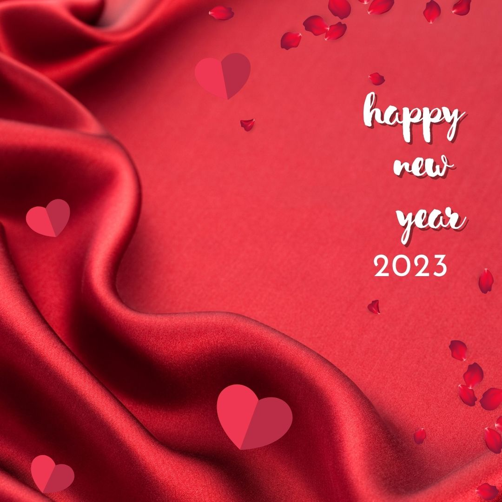
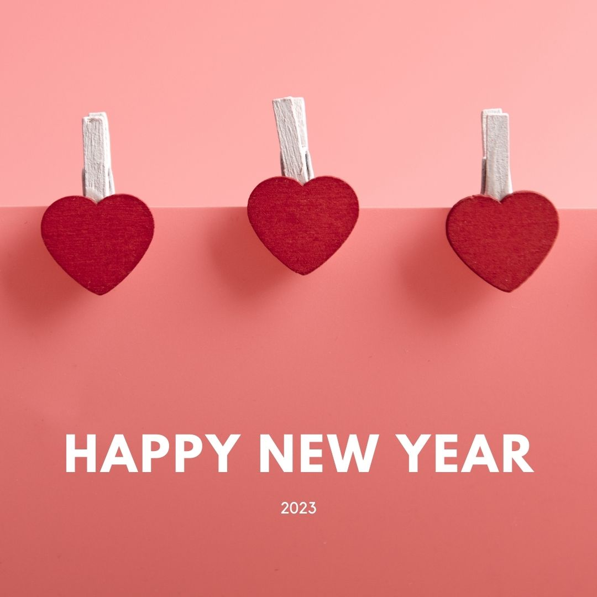
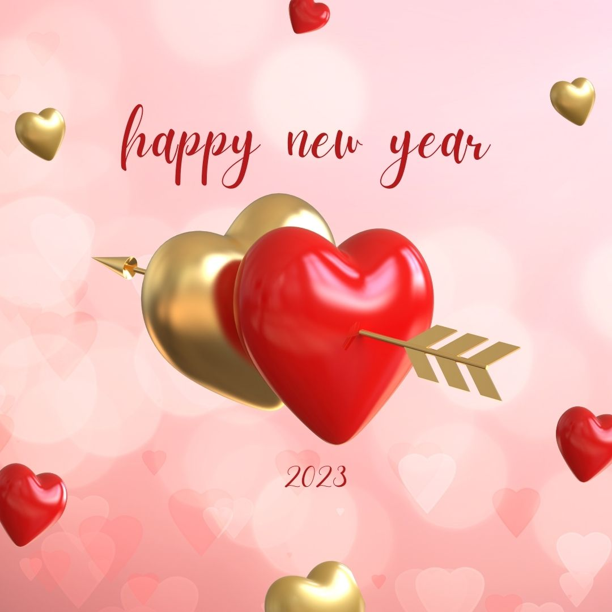
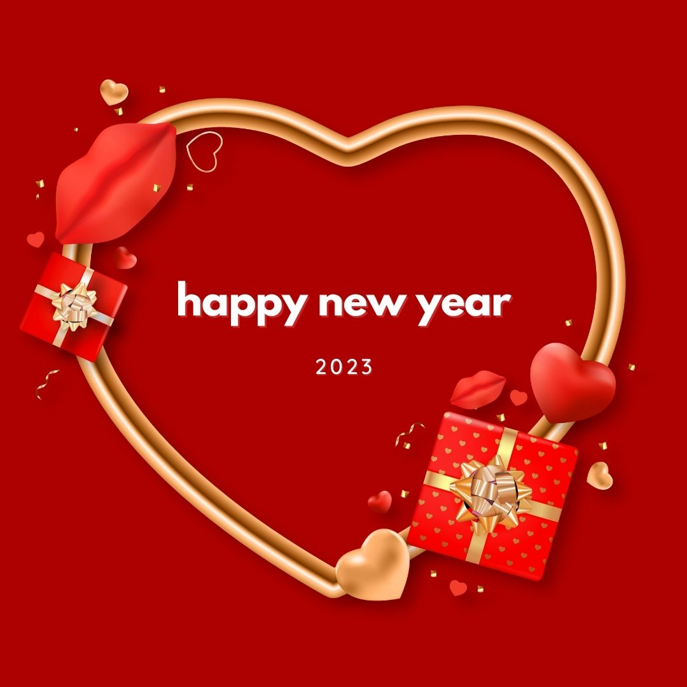

### What does it mean to be in love?

The love of a lifetime is something that can be felt from the moment you meet your partner until the day you die. True love is a feeling that fills your heart with happiness and makes every day worth living. It's a feeling that you can't just explain, you have to experience it for yourself. When two people are in love, they're always happy and their relationship is unlike any other. They're able to share secrets and feel comfortable around each other even when there's screaming and yelling. Falling in love is an amazing experience and it's something that should be cherished forever.

### What are the benefits of being in a loving relationship?

1. Love is in the air this year! Whether you're single or coupled up, there's something special about this time of year. Let's enjoy every moment and make 2018 our best year yet!
2. New Year's resolutions are a great way to start off the new year, but don't forget to keep your love life in mind! Make sure you're spending enough time with your partner and taking advantage of all the opportunities that come your way.
3. Feeling single? Don't feel bad about it! There's nothing wrong with wanting to be in a relationship. If you're feeling a little lonely, don't be afraid to reach out to someone and start dating again. We all need love and companionship from time to time!
4. Remember to keep your goals in mind throughout the year. You may want to extend your career or take on a new hobby, but remember that you should also make time for yourself.
5. How do you plan on spending the holidays? With family, friends, and/or alone?

### happy new year my love kiss

#### Hello everyone!

This year is going to be amazing. I can feel it. And I'm sure my love feels the same way. As we approach the New Year, we all have so much to be grateful for. We should all make a point to appreciate the good in our lives, and take time for ourselves. That's why I want to share my top 5 New Year's resolutions for love. Here they are:

1. Spend more time with my love
2. Let go of any grudges or resentments we may have towards one another
3. Be more understanding and supportive towards each other
4. Make sure to take time for ourselves every day and enjoy life's little moments
5. Appreciate our relationship more than ever before!

### happy new year my love images

This year, let's make love a priority. Let's not only celebrate it with friends and family, but let's also make it the focus of our lives. How can we do that? Start by treating each other with respect and kindness, and letting our love shine through. Here are some happy new year my love images to get you started! Happy New Year my love images 2018 - Love Quotes For Your Boyfriend New Year, New You Image - Happy New Year Quotes Images And Wishes

Happy new year my love images is an image that will let you convey your feelings to him in a simple and beautiful way. Use these quotes to express your love for him in a way that will make your relationship really special and meaningful.

### happy new year my love wishes

It's that time of year again when we reflect on all that has happened in the past year and look forward to all the wonderful things that will happen in the year ahead. And what better way to start off the new year than by celebrating love? Whether it be with family, friends, or your significant other, love is in the air! Here are some great ways to share that love with your loved ones.

### happy new year love quotes

1. This New Year, let love be in the air! Whether it’s with family, friends or your significant other, make 2018 the year you let love reign supreme.
2. No matter what happened in 2017, it’s time to start fresh and posit that love is the one thing that truly matters in life. So dust off those old wounds and let yourself feel loved for who you really are.
3. Love is in the air, but it can t be smelled. So let s get some fresh roses and some warm champagne, and celebrate love on New Year s Day!
4. It s time to take a chance on love again.

### happy new year love shayari

This year, love is in the air! Whether you're single and looking for love or you're already in a relationship and just want to feel happy, here are five things to keep in mind to help you stay romance-saturated all year long. 1. Keep an open mind when it comes to dating. If you've been looking for love since you were 18, chances are that you're pretty picky when it comes to dating. After all, who wants to date someone who doesn t make them feel good about themselves?

### love happy new year shayari

New Year, New You! Love is in the air and so are new beginnings. Whether beginning a fresh journey or taking on a new challenge, January is the perfect time to start fresh and set your intentions for the year ahead. So what are you waiting for? Start planning your love story today!

### happy new year shayari love

shayari for new year Happy New Year Quotes For Couples. 

### How do we find love?

In the new year, love is in the air! For some, this might mean celebrating with their loved ones; for others, it might mean finding their new love. Regardless of where you are in your love life, here are five things to keep in mind to help 2017 be the best year yet for love.

### How can we keep our love alive over time?

Love is in the air! Happy New Year my love. This year, let us make resolutions to be happier and more connected with each other. Let us cherish each moment we have together and take advantage of all the new opportunities that arise. Love is in the air!

### Tips for making your relationship happy and healthy!

People all around the world are exchanging love messages and rings in preparation for the New Year. The holiday season is a time to express your love for someone in a special way, and it's the perfect time to propose! Here are some creative ideas for how to show your love this year.

